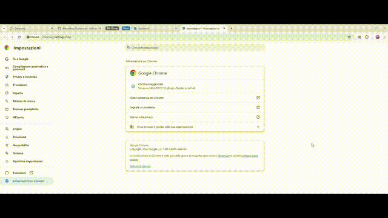

# Back All Grouped Tabs

A tiny unpacked Chrome extension that sends a single **Back** navigation to every tab that belongs to a [Chrome Tab Group](https://support.google.com/chrome/answer/12399726), leaving ungrouped tabs untouched.

## Why this exists

After restarting Chrome, tabs that were suspended by extensions like [The Marvellous Suspender](https://github.com/gioxx/MarvellousSuspender) (or similar tab-suspending extensions) can come back as **blank `chrome://newtab/` pages** instead of their suspended placeholder page — even though the tab's browsing history still contains the correct `suspended.html#...` entry.

This is a known, long-standing Chrome bug related to how *discarded* tabs are restored on session restore: the tab is marked as `discarded`, its `url` may still report the old `suspended.html` page internally, but the rendered content is a blank new-tab page. A manual click on the browser's **Back** button fixes it instantly — Chrome just needs the tab to be "woken up" before `goBack()` will work.

Doing this manually for 20+ tabs across multiple tab groups, every time you restart Chrome, gets old fast. This extension automates it with a single click.

## What it does

1. Finds every tab that belongs to **any** tab group (in the current window), regardless of which group.
2. For each of those tabs:
   - Temporarily activates the tab (this forces Chrome to actually load/restore it, which is required before its history becomes accessible).
   - Waits until the tab reports `status: "complete"` (with a 2-second safety timeout, in case a tab never settles).
   - Calls `chrome.tabs.goBack(tabId)` to step back one entry in that tab's history — restoring the `suspended.html#...` page.
3. Restores focus to whichever tab was active before you clicked the extension button.
4. Restores the collapsed/expanded state of every tab group it touched — if a group was collapsed before, it gets collapsed again afterwards.
5. Shows a badge on the toolbar icon: an amber `...` while running, then a green count of how many tabs were processed (or red if zero).

Tabs **not** in any tab group are never touched.

## Installation

1. Download or clone this repository.
2. Open `chrome://extensions` in Chrome.
3. Enable **Developer mode** (toggle in the top-right corner).
4. Click **"Load unpacked"** and select this folder.
5. The extension icon will appear in your toolbar.

## Usage

1. After restarting Chrome (or whenever some grouped tabs look "blank"), click the extension's toolbar icon **once**.
2. Watch the tabs in your tab groups briefly flash as they're activated and stepped back — this is expected and necessary.
3. When done, the badge turns green with the number of tabs that were successfully sent back, and your original active tab regains focus.

## Demo

The GIF shows how to load the extension and how a single click resolves the blank-tab issue across grouped tabs.

## Notes / limitations

- Only operates on the **current window** — if you have multiple Chrome windows open, run it once per window.
- A tab with no "Back" entry in its history (e.g. a tab that was never navigated) is simply skipped — `goBack()` fails silently for that tab and it's counted, but otherwise left as-is.
- The brief activation of each tab is intentional and currently the only reliable way to force Chrome to restore a discarded tab's history before calling `goBack()`.

## License

MIT
